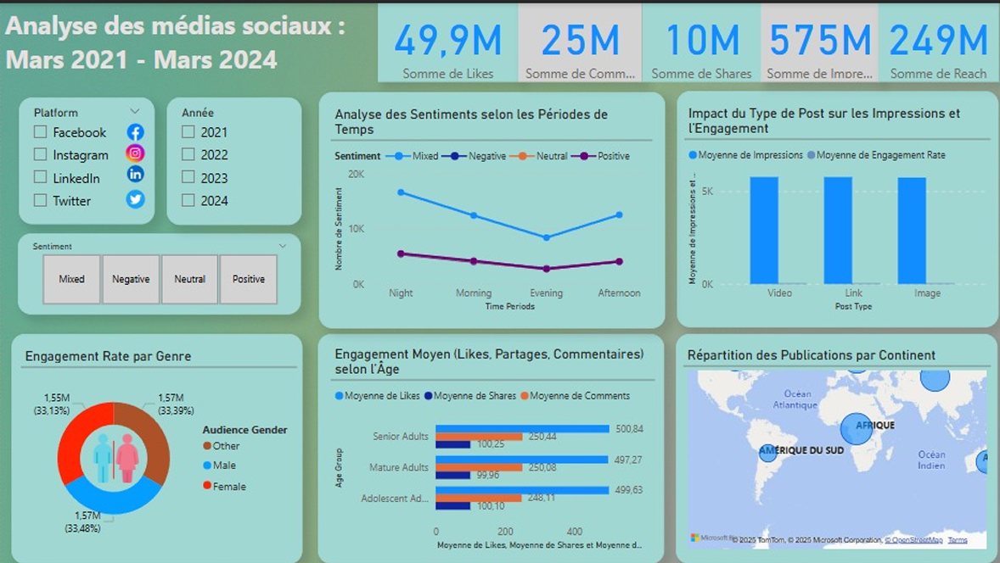

# Social Media Analysis Dashboard

## Table of Contents
1. [Project Overview](#project-overview)
2. [Objectives](#objectives)
3. [Dataset Description](#dataset-description)
4. [Technologies Used](#technologies-used)
5. [Data Analysis & Visualization](#data-analysis--visualization)
6. [Dashboard Design](#dashboard-design)
7. [Repository Structure](#repository-structure)
8. [Key Insights](#key-insights)
9. [Conclusion](#conclusion)
10. [Contacts](#contacts)

---

## Project Overview

This project focuses on the analysis of social media engagement data through an interactive Power BI dashboard.  
The goal is to help better understand user interactions, brand perception, and platform performance across multiple social media channels such as Facebook, Twitter, Instagram, and LinkedIn.


---

## Objectives

The main objectives of this project are to:

- Analyze user engagement metrics (likes, comments, shares)
- Track brand mentions and sentiment trends
- Compare performance across different social media platforms
- Identify the most engaging content types and optimal posting times
- Provide decision-support insights through interactive dashboards

---

## Dataset Description

The dataset used in this project was obtained from **Kaggle** and contains social media engagement data, including:

- Platform information (Facebook, Twitter, Instagram, LinkedIn)
- User interaction metrics (likes, comments, shares)
- Brand mentions
- Sentiment analysis (positive, negative, neutral)
- Content types and posting periods

The data is provided in CSV format and was prepared before being loaded into Power BI.

---

## Technologies Used

Based on the project implementation and report:

- **Power BI** – Data visualization and interactive dashboard design
- **Python (Pandas, NumPy)** – Data cleaning and preprocessing
- **CSV datasets** – Data source
- **Git & GitHub** – Version control and project sharing

---

## Data Analysis & Visualization

The analysis focuses on several key aspects:

- **Global engagement analysis**  
  Evaluation of likes, comments, and shares to measure overall engagement.

- **Brand mentions & sentiment analysis**  
  Monitoring brand perception by analyzing sentiment trends across platforms.

- **Platform performance comparison**  
  Identifying which social networks generate the highest engagement.

- **Content & time analysis**  
  Detecting the most engaging post types and the most active time periods.

All results are presented using dynamic and interactive visualizations in Power BI.

---

## Dashboard Design

The Power BI dashboard includes:

- KPI indicators for engagement metrics
- Interactive filters (platform, sentiment, time period)
- Charts for engagement trends and comparisons
- Visual analysis of content performance and audience activity





## Repository Structure

```plaintext
Dashboard-Social-Media-Analysis
│   README.md
│
├── data
│   └── social_media_data.csv
│
├── powerbi
│   └── Social_Media_Dashboard.pbix
│
├── assets
│   └── dashboard.png
│
└── report
    └── Rapport_mini_Projet_Power_BI.pdf
```

---

## Key Insights

* Certain platforms generate significantly higher engagement than others
* Video and visual content tend to attract more interactions
* Engagement varies depending on posting time and audience activity
* Sentiment analysis helps identify strengths and weaknesses in brand perception

---

## Conclusion

This project demonstrates how social media data can be effectively analyzed and visualized to support digital strategy decisions.
Through Power BI dashboards, complex datasets are transformed into clear, actionable insights that help optimize engagement and communication strategies.

---

## Contacts

For any questions or collaboration opportunities:

* **Name**: Mohamed Boukechouch
* **GitHub**: [https://github.com/medboukechouch](https://github.com/medboukechouch)
* **LinkedIn**: [https://www.linkedin.com/in/mohamed-boukechouch/](https://www.linkedin.com/in/mohamed-boukechouch/)
* **Mail**: `med.boukechouch@gmail.com`


